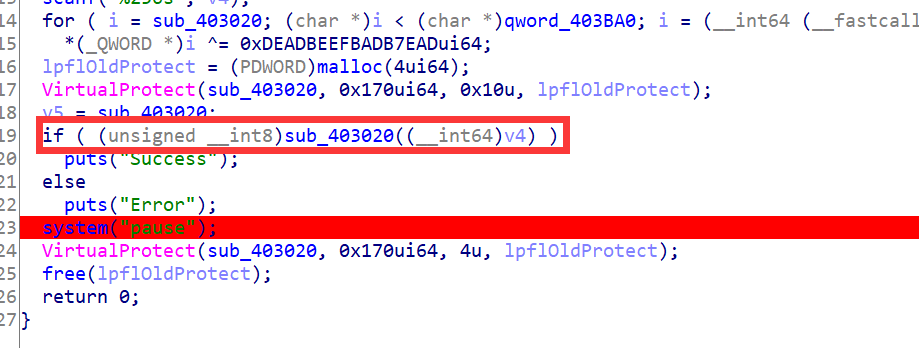
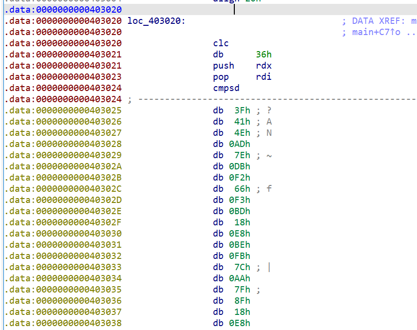
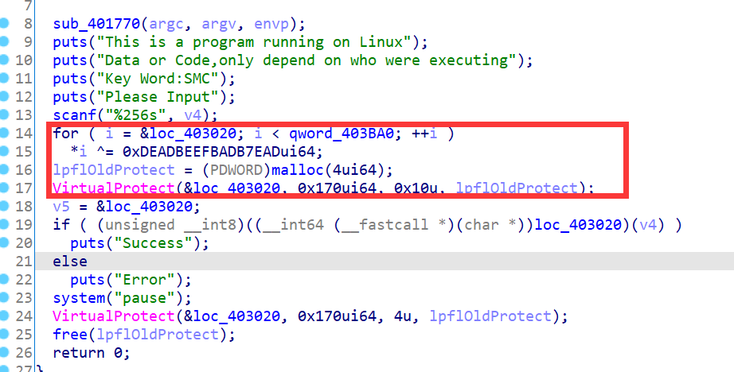
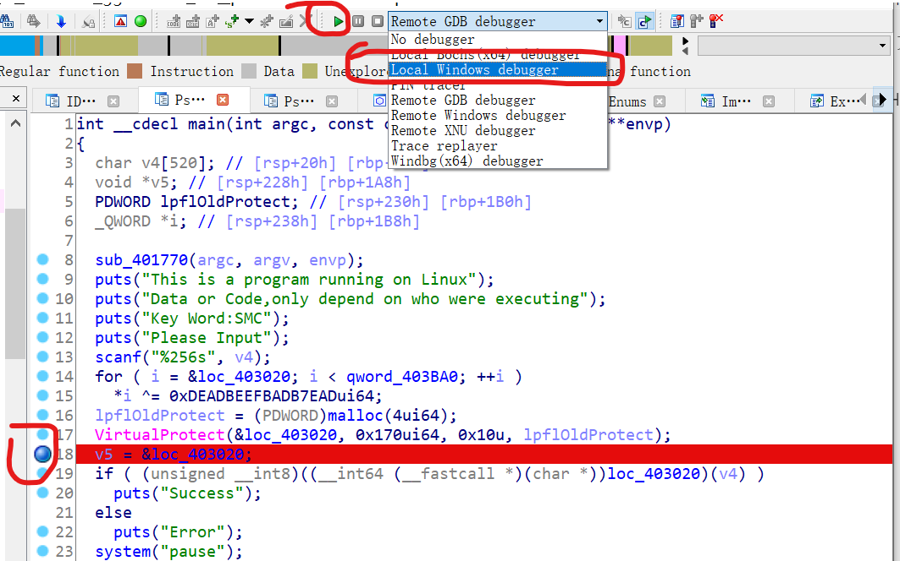
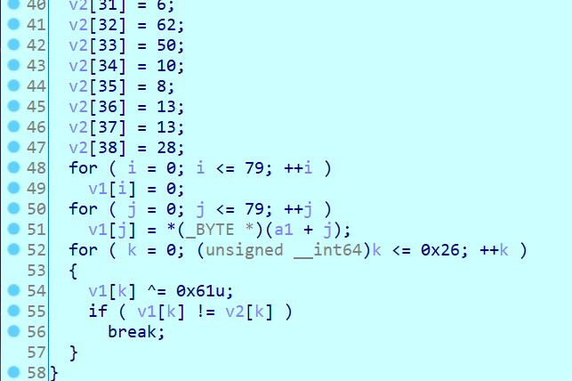
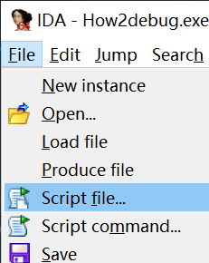

# How2Debug

`ACTF{SMC_Protect_Need_Your_Debug_Skill}`

## 这题有个小bug

SMC没写好，所以程序正常运行结束的时候会报错（页面读写权限错误)

不过不影响其正常功能(

## 解题思路

目光聚焦在判断函数



点进去一看，居然是乱码？



向前回到main函数，发现有个位置在对这里做运算，并且修改了这一个内存页的读写权限为可执行权限



下断点于循环结束之后，开始调试



此时在点进loc_403020，按一下P键，再按一下F5,即可看到解密后的函数



至此，写逆算法就行了。

这个题目在获取enc_flag上有点麻烦。可以复制伪代码，或者正则表达式处理。

不过这里给出一种使用idapython来获取数据的题解：

**SMC解密循环结束之后**，然后用ida执行下面的python脚本



```python
from idc import *

start = 0x40302F
end = 0x4030CB
enc_flag = []
i = start
while i <= end:
    enc_flag.append(get_operand_value(i, 1))
    i = find_code(i,SEARCH_DOWN)
print(len(enc_flag))
for i in enc_flag:
    print(chr(i^0x61),end = '')

```

