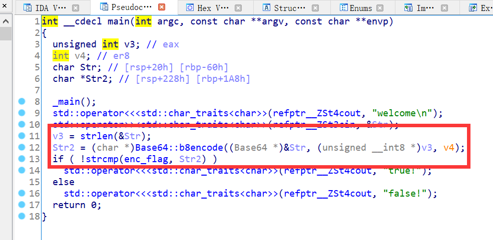
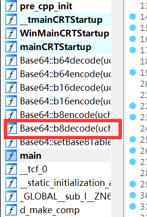

# 使用ida分析程序

加密逻辑同样十分明显，但是这里有一个base8编码。点进去看一下b8encode的逻辑

# 逆向分析b8decode()

base8编码的原理类似base64，但是需要我们手写脚本解密。

熟悉base64原理的话，可以手写一个base8编码出来。但是我们可以注意到程序中已经有base8decode这个函数了

我们可以模仿b8decode的伪代码写一个exp出来

